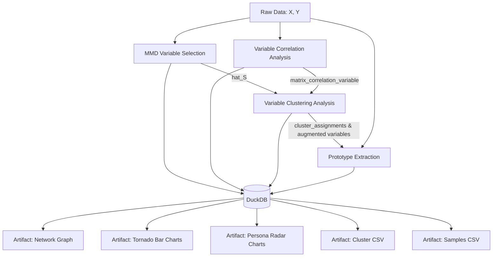

# Analysis Project: MMD Variable Selection & Insight Generation

## Context

Author Paper: [arXiv:2311.01537](https://arxiv.org/abs/2311.01537)

The core method proposes a mathematically rigorous algorithm for Maximum Mean Discrepancy (MMD)-based variable selection to identify distributional shifts between two distributions $P$ and $Q$.

Reviewers often note that purely statistical two-sample testing applications lack an "immediate", practical utility for industry stakeholders. This project expands MMD-based variable selection from an isolated sparse feature selector into the initiator of a complete, human-interpretable insight generation and data analysis workflow.

---

## Formal Description

### Preliminaries and Notation

Let $X = \{x_1, \dots, x_{n_X}\}$ and $Y = \{y_1, \dots, y_{n_Y}\}$ be sets of samples drawn from distributions $P$ and $Q$ on $\mathbb{R}^d$.

Let $V = \{1, 2, \dots, d\}$ denote the index set of all original variables.

Let $\hat{S} \subset V$ denote the sparse, intrinsic subset of variables selected by the proposed MMD-based algorithm, such that the discrepancy between $P$ and $Q$ is primarily captured in the subspace spanned by $\hat{S}$.

For any vector $v \in \mathbb{R}^d$ and subset $S \subseteq V$, let $v_S \in \mathbb{R}^{|S|}$ denote the restriction of $v$ to the indices in $S$.

### 1. Variable Augmentation

To provide human-interpretable context, we model the relationships among all variables $V$ using the pooled dataset $Z = X \cup Y$. Let $\Sigma \in \mathbb{R}^{d \times d}$ be a matrix capturing the pairwise relationships between variables (e.g., an absolute correlation matrix, or a precision matrix $\Theta$ derived via Graphical Lasso where $\Sigma_{ij} = |\Theta_{ij}|$).

#### 1.1. Variable Augmentation: Fetching Top-$K$ Variables

For each intrinsically selected variable $s \in \hat{S}$, we identify the subset of $K$ variables outside of $s$ that exhibit the strongest statistical relationship with $s$.

Let $A_s$ be the set of the top-$K$ correlated variables for a given $s \in \hat{S}$:

$$A_s = \underset{\substack{U \subset V \setminus \{s\} \\ |U| = K}}{\arg\max} \sum_{u \in U} \Sigma_{s, u}$$

We define the augmented variable subset for $s$ as $\tilde{S}_s = \{s\} \cup A_s$. The globally augmented feature set, which represents the overarching "themes," is the union of these local neighborhoods:

$$\tilde{S} = \bigcup_{s \in \hat{S}} \tilde{S}_s$$

#### 1.2. Variable Augmentation: Clustering and Identifying Related Variables

Instead of a fixed $K$, we partition the global variable space into distinct clusters to capture latent semantic groupings.

Let $\mathcal{C}$ be a clustering algorithm applied to the relationship matrix $\Sigma$ (or the graph induced by the Graphical Lasso precision matrix). We partition the variable set $V$ into $M$ disjoint clusters:

$$\mathcal{C}(V, \Sigma) \rightarrow \{C_1, C_2, \dots, C_M\}$$

such that $\bigcup_{m=1}^M C_m = V$ and $C_i \cap C_j = \emptyset$ for $i \neq j$.

For each selected variable $s \in \hat{S}$, let $C(s) \in \{C_1, \dots, C_M\}$ denote the specific cluster containing $s$. The augmented variable set is the union of the clusters that contain at least one MMD-selected anchor variable:

$$\tilde{S} = \bigcup_{s \in \hat{S}} C(s)$$

### 2. Top-$N$ Examples Explanation

To ground the selected variables in reality, we extract concrete samples (prototypes) that best exemplify the distributional differences in the selected subspaces.

Let $D(x_S; X_S, Y_S)$ be a plugin distance or scoring metric computed on a generic subspace $S$. This function quantifies how "exemplary" or "discriminative" a sample $x_S$ is (e.g., Mahalanobis distance to the center of $X_S$, or a point-wise anomaly/discrepancy score against $Y_S$).

#### 2.1. Top-$N$ Examples: With $\hat{S}$

Here, we restrict our focus exclusively to the strict variables selected by the algorithm.

We project the datasets into $\mathbb{R}^{|\hat{S}|}$ to obtain $X_{\hat{S}}$ and $Y_{\hat{S}}$. For a given distribution (e.g., $X$), we evaluate $D(x_i; X_{\hat{S}}, Y_{\hat{S}})$ for all $x_i \in X$.

The set of top-$N$ prototypical examples $E_X \subset X$ is extracted by maximizing the scoring metric:

$$E_X = \underset{\substack{E \subset X \\ |E| = N}}{\arg\max} \sum_{x \in E} D(x_{\hat{S}}; X_{\hat{S}}, Y_{\hat{S}})$$

*(A symmetric operation is performed on $Y$ to extract $E_Y$).*

#### 2.2. Top-$N$ Examples: With the Augmented Variables ($\tilde{S}$)

Here, we use the semantically expanded variable set to find prototypes that embody the broader "themes" rather than just the sparse anchors.

We project the datasets into $\mathbb{R}^{|\tilde{S}|}$ to obtain $X_{\tilde{S}}$ and $Y_{\tilde{S}}$. The distance metric $D$ is now evaluated in this higher-dimensional, semantically rich subspace.

The set of top-$N$ prototypical examples $\tilde{E}_X \subset X$ is determined by:

$$\tilde{E}_X = \underset{\substack{E \subset X \\ |E| = N}}{\arg\max} \sum_{x \in E} D(x_{\tilde{S}}; X_{\tilde{S}}, Y_{\tilde{S}})$$

By presenting this formalization, MMD variable selection is not an isolated endpoint, but rather a mathematically rigorous initiator $s \in \hat{S}$ for an interpretable data analysis workflow.

---

## MMD Variable Selection & Insight Generation System Plan

### 1. Pipeline Architecture

The system takes high-dimensional raw data $(X, Y)$ and processes it through a strict workflow:



### 2. Database Schema (DuckDB)

The internal data warehouse normalizes the analytical outputs for rapid SQL-driven artifact generation:

- **`analysis_variable_selection`**
  - `id_variable` (int) [Primary Key]
  - `name_variable` (varchar)
  - `weight` (float) — *The MMD selection weight.*

- **`analysis_variable_correlation`** *(Refined as an edge list)*
  - `id_variable_1` (int)
  - `id_variable_2` (int)
  - `correlation_score` (float) — *Derived from Graphical Lasso precision matrix or correlation.*

- **`analysis_variable_clustering`**
  - `id_variable` (int)
  - `id_cluster` (int)
  - `score_related` (float) — *Calculated as $\max_{s \in \hat{S}_{\text{cluster}}} |\text{corr}(v, s)|$. NA if the cluster does not contain any $s \in \hat{S}$.*

- **`analysis_representative_samples`**
  - `id_sample` (int)
  - `label_class` (varchar) — *The original class, e.g., 'X' or 'Y'.*
  - `is_prototype_for` (varchar) — *Specifies if it represents X or Y within the augmented subspace.*
  - `distance_score` (float) — *The distance metric (e.g., Mahalanobis) ranking its prototypicality.*

### 3. System Artifacts (Deliverables)

#### 3.1. Tabular Artifacts (CSV)

1. **Cluster Analysis (`cluster_analysis.csv`)**: Contains `id_variable`, `name_variable`, `id_cluster`, and `score_related`. Used by analysts to inspect the top-correlated metrics for a selected anchor.
2. **Representative Samples (`representative_samples.csv`)**: Contains `id_sample`, `label_class`, `distance_score`, and `type_S` (`hat_S` or `hat_S_augmented`), joined with original raw sample features for inspection.

#### 3.2. Visual Artifacts (For Non-Technical Stakeholders)

1. **Visualization 1: The "Constellation" Network Graph**
   - **Purpose:** Display the global landscape of variables.
   - **Design:** Force-directed layout where nodes are variables and edges represent correlations. Variables in $\hat{S}$ are rendered as large, prominent nodes, with highly correlated variables pulled into color-coded clusters around them.
   - **Generation Rule:** Query `analysis_variable_correlation` for edges where `correlation_score` exceeds a threshold (e.g., 0.3). Nodes are sized by presence in `analysis_variable_selection` and colored by `id_cluster`.

2. **Visualization 2: Thematic "Tornado" Bar Charts**
   - **Purpose:** Explain what an MMD-selected anchor variable means in business terms.
   - **Design:** Horizontal bar chart per cluster containing at least one anchor $s \in \hat{S}$, showing the top-$K$ most correlated variables ranked by `score_related`.
   - **Generation Rule:** For each valid cluster:
     ```sql
     SELECT name_variable, score_related 
     FROM analysis_variable_clustering 
     WHERE id_cluster = [current_id] 
     ORDER BY score_related DESC 
     LIMIT 10;
     ```
   - **Titling:** *"Theme: [Anchor Variable Name]"* (or *"Theme: [Anchor 1] & [Anchor 2]"* if multiple anchors exist in the cluster).

3. **Visualization 3: Persona Radar (Spider) Charts**
   - **Purpose:** Contrast the Top-1 prototypical sample of distribution $X$ against that of distribution $Y$.
   - **Design:** Radar chart plotting normalized values of augmented variables ($\tilde{S}$) for a cluster, visualizing the concrete shape of the detected distributional shift.
   - **Generation Rule:**
     - **Hard Limit:** Maximum of 8 variables per cluster to prevent visual clutter.
     - **Variable Selection:** Must include cluster anchor(s) $s \in \hat{S}$; remaining slots filled by augmented variables with highest `score_related`.
     - **Value Normalization:** Feature values must be min-max normalized to $[0, 1]$ or Z-score standardized prior to plotting.

---

## Target Datasets & Implementation Plans

### Dataset 1: The Speed Dating Experiment (Columbia Business School)

- **Domain:** Social / Behavioral Psychology (easily understood without specialized domain knowledge).
- **Dimensions:** 195 features.
- **Sample Size:** 8,378 individual observations $\rightarrow$ ~4,000 to 4,100 intact reciprocal date pairs.
- **Labels ($X, Y$):**
  - $X$ (Matched Pairs, `Match = 1`): ~650 to 800 samples (~16–20%).
  - $Y$ (Unmatched Pairs, `Match = 0`): ~3,300 to 3,450 samples.
- **Why it fits:** Formulates the problem as *"What exact traits distinguish a mutually successful date from an unsuccessful one?"* Features include self-ratings, ratings of the partner, shared interests, and demographics.
- **Source:** Kaggle ("Speed Dating Experiment").

#### Paired Sample Construction
Each date involves two individuals (`person_a` and `person_b`, historically male and female in the Columbia dataset):
- 8,378 subjective reports yield ~4,100 reciprocal interaction pairs where both participants completed evaluations.

#### Preprocessing Pipeline
1. Download dataset.
2. Allocate unique ID if not already present.
3. Form date pairs:
   - Split dataset by gender into Male (`iid`) and Female (`pid`) dataframes.
   - Inner join on event and partner IDs.
4. Construct joint feature space:
   - Unique pair ID: $\text{hash}(\text{iid}_{\text{male}}, \text{iid}_{\text{female}})$.
   - Concatenate features: Side-by-side vectors (e.g., `Male_Age`, `Female_Age`, `Male_Interest_Art`, `Female_Interest_Art`).
   - Interaction/Delta features: Difference metrics capturing homophily (e.g., $\text{Age\_Gap} = |\text{Male\_Age} - \text{Female\_Age}|$, $\text{Art\_Interest\_Diff} = |\text{Male\_Interest\_Art} - \text{Female\_Interest\_Art}|$, $\text{Same\_Race} \in \{0, 1\}$).
5. **Z-Score Standardization ($\mu=0, \sigma=1$):**
   - Essential across all features because variables span heterogeneous scales (1–10 subjective ratings, age in years, binary flags, and delta scores).
   - Prevents larger scale variables from dominating the $L_2$ norm within the MMD kernel, ensuring equal opportunity for intrinsic variable selection.
6. Persist raw and generated features into DuckDB.
7. Export standardized feature-sample matrix as a NumPy structured array.

#### TODO / Open Question
- Define explicit inclusion and exclusion criteria for raw survey features before generating the joint pair feature space.

---

### Dataset 2: Ames Housing Dataset (Advanced Real Estate)

- **Domain:** Real Estate / Macroeconomic Shift.
- **Dimensions:** 80 natural features (expands to 150+ with one-hot encoding).
- **Sample Size:** 2,930 observations.
- **Source:** Kaggle ("House Prices - Advanced Regression Techniques") / OpenML (ID: 42165).

#### Two-Sample Labels ($X$ and $Y$)
Temporal boundary centered around the 2008 financial crisis:
- **Distribution $X$ (Pre-Crash Market):** Homes sold in 2006 and 2007.
- **Distribution $Y$ (Post-Crash Market):** Homes sold in 2009 and 2010.
- *Business Question:* Detect which physical, architectural, and neighborhood attributes distinguished the properties that sold during the housing bubble versus during the subsequent recession (dropping temporal targets `YrSold`, `MoSold`, and `SalePrice`).

#### Feature Categories
- **Continuous / Area Metrics:** `GrLivArea`, `LotArea`, `TotalBsmtSF`, `GarageArea`.
- **Ordinal / Quality Metrics:** `OverallQual`, `OverallCond`, `KitchenQual`, `BsmtQual`.
- **Nominal / Categorical Metrics:** `Neighborhood`, `HouseStyle`, `BldgType`, `Foundation`.

#### Data Processing Pipeline
1. **Domain NA Trap & Imputation:**
   - In Ames, `NA` in features like `PoolQC`, `GarageType`, or `FireplaceQu` denotes absence of the feature rather than missing data. Fill categorical `NA`s with `"None"` and continuous `NA`s (e.g., `GarageArea`) with `0`.
   - Impute genuine missing values (e.g., `LotFrontage`) using the median within that specific neighborhood.
2. **Explicit Encoding:**
   - **Ordinal Variables:** Map text scales monotonically to integers: $\text{Ex} \rightarrow 5$, $\text{Gd} \rightarrow 4$, $\text{TA} \rightarrow 3$, $\text{Fa} \rightarrow 2$, $\text{Po} \rightarrow 1$ to preserve distance metrics for MMD.
   - **Nominal Variables:** Apply One-Hot Encoding to categorical variables (`Neighborhood`, `RoofStyle`), expanding dimension to 150+.
3. **Z-Score Standardization ($\mu=0, \sigma=1$):**
   - Standardize all continuous, encoded ordinal, and one-hot variables.
   - Prevents massive scale attributes like `LotArea` (10,000+ sq ft) from dominating the MMD kernel $L_2$ norm and overshadowing critical categorical or quality indicators.
