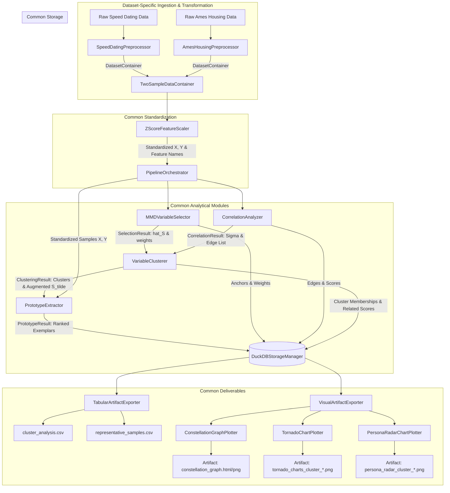

# Package and Module Architecture Plan: Common Components Extraction

## 1. Overview & Architectural Rationale

This document defines the software architecture and package structure for the **MMD Variable Selection & Insight Generation System**.

Across both target projects—**The Speed Dating Experiment** and **The Ames Housing Market Analysis**—the downstream analytical tasks, statistical modeling, database persistence, and artifact visualizations are identical. The differences between the projects are strictly isolated to **dataset loading**, **feature engineering / domain transformation**, and **two-sample label partitioning ($X$ vs. $Y$)**.

By extracting all domain-agnostic logic into reusable common components, the system achieves:
1. **Separation of Concerns:** Dataset-specific quirks (e.g., speed dating reciprocal pairs vs. real estate "Domain NA" handling) are decoupled from the statistical analysis engine.
2. **Reusability:** Any future two-sample dataset can be plugged in by implementing a single dataset adapter.
3. **Reproducibility & Testability:** Common algorithmic modules (MMD selection, Graphical Lasso / correlation, agglomerative clustering, Mahalanobis prototype extraction, DuckDB persistence, and chart plotting) can be unit-tested independently of raw CSV data files.

---

## 2. Common vs. Dataset-Specific Separation

| Architectural Layer | Speed Dating Project | Ames Housing Project | Common Component |
| :--- | :--- | :--- | :--- |
| **Data Ingestion** | Raw survey CSV | Raw housing CSV / OpenML | Dataset-specific Loader |
| **Data Cleaning** | Participant pairing, reciprocal flags | Domain NA imputation (`PoolQC="None"`, `LotFrontage` median) | Dataset-specific Preprocessor |
| **Feature Transformation** | Concatenated profile traits, difference deltas | Ordinal integer mapping, One-Hot Encoding | Dataset-specific Preprocessor |
| **Label Partitioning ($X, Y$)** | Matched (`Match=1`) vs. Unmatched (`Match=0`) | Pre-Crash (2006–2007) vs. Post-Crash (2009–2010) | Common Dataset Interface |
| **Feature Standardization** | Z-Score Standardization ($\mu=0, \sigma=1$) | Z-Score Standardization ($\mu=0, \sigma=1$) | **Common Component (`common.scaler`)** |
| **MMD Variable Selection** | MMD kernel test to identify anchor set $\hat{S}$ | MMD kernel test to identify anchor set $\hat{S}$ | **Common Component (`mmd.selector`)** |
| **Variable Correlation** | Pairwise correlation / Graphical Lasso precision | Pairwise correlation / Graphical Lasso precision | **Common Component (`correlation.analyzer`)** |
| **Variable Clustering & Augmentation** | Cluster $\Sigma$, find $C(s)$, build $\tilde{S}$ & `score_related` | Cluster $\Sigma$, find $C(s)$, build $\tilde{S}$ & `score_related` | **Common Component (`clustering.clusterer`)** |
| **Prototype Extraction** | Mahalanobis / discrepancy score on $\hat{S}$ and $\tilde{S}$ | Mahalanobis / discrepancy score on $\hat{S}$ and $\tilde{S}$ | **Common Component (`prototype.extractor`)** |
| **Data Warehouse** | DuckDB 4-table normalized schema | DuckDB 4-table normalized schema | **Common Component (`database.manager`)** |
| **Artifact Generation** | Constellation graph, Tornado bars, Radar charts | Constellation graph, Tornado bars, Radar charts | **Common Component (`visualization.*`, `export.*`)** |
| **Pipeline Runner** | Orchestrator pipeline | Orchestrator pipeline | **Common Component (`pipeline.runner`)** |

---

## 3. Mermaid Architecture & Component Relations

### 3.1. System Data Flow & Component Relations



---

### 3.2. Class & Module Relations

```mermaid
classDiagram
    class BaseDatasetPreprocessor {
        <<interface>>
        +prepare_two_sample_data(path_data: str) TwoSampleDataContainer
    }

    class SpeedDatingPreprocessor {
        +prepare_two_sample_data(path_data: str) TwoSampleDataContainer
        -_pair_participant_records(df_raw: DataFrame) DataFrame
        -_create_interaction_features(df_paired: DataFrame) DataFrame
    }

    class AmesHousingPreprocessor {
        +prepare_two_sample_data(path_data: str) TwoSampleDataContainer
        -_clean_domain_na(df_raw: DataFrame) DataFrame
        -_encode_ordinal_features(df_clean: DataFrame) DataFrame
        -_encode_nominal_features(df_encoded: DataFrame) DataFrame
    }

    class TwoSampleDataContainer {
        +sample_matrix_x: ndarray
        +sample_matrix_y: ndarray
        +name_features: list[str]
        +metadata_dataset: dict
    }

    class ZScoreFeatureScaler {
        +scale_features_zscore(container: TwoSampleDataContainer) ScaledDataContainer
    }

    class MMDVariableSelector {
        +select_variables_mmd(sample_x: ndarray, sample_y: ndarray, names_variables: list[str]) VariableSelectionResult
    }

    class CorrelationAnalyzer {
        +compute_matrix_correlation(matrix_pooled: ndarray, method: str) CorrelationResult
    }

    class VariableClusterer {
        +cluster_variables_relationship(matrix_rel: ndarray, list_selected_anchors: list[int], names_variables: list[str]) VariableClusteringResult
    }

    class PrototypeExtractor {
        +extract_samples_prototype(sample_x: ndarray, sample_y: ndarray, list_subspace_indices: list[int], top_n: int) PrototypeSampleResult
    }

    class DuckDBStorageManager {
        +path_database: str
        +initialize_tables() void
        +insert_variable_selection(result: VariableSelectionResult) void
        +insert_variable_correlation(result: CorrelationResult) void
        +insert_variable_clustering(result: VariableClusteringResult) void
        +insert_representative_samples(result: PrototypeSampleResult) void
        +query_records_sql(sql_statement: str) DataFrame
    }

    class PipelineOrchestrator {
        +run_analysis_pipeline(preprocessor: BaseDatasetPreprocessor, path_raw: str, path_output: str) void
    }

    BaseDatasetPreprocessor <|.. SpeedDatingPreprocessor
    BaseDatasetPreprocessor <|.. AmesHousingPreprocessor
    BaseDatasetPreprocessor ..> TwoSampleDataContainer : produces
    PipelineOrchestrator --> BaseDatasetPreprocessor : uses
    PipelineOrchestrator --> ZScoreFeatureScaler : uses
    PipelineOrchestrator --> MMDVariableSelector : uses
    PipelineOrchestrator --> CorrelationAnalyzer : uses
    PipelineOrchestrator --> VariableClusterer : uses
    PipelineOrchestrator --> PrototypeExtractor : uses
    PipelineOrchestrator --> DuckDBStorageManager : persists to
```



---

## 4. Package Directory Layout

The proposed directory tree for `data_analysis_variable_selection`:

```
data_analysis_variable_selection/
├── __init__.py
├── common/
│   ├── __init__.py
│   ├── base_preprocessor.py        # Abstract Base Class for dataset preprocessors
│   ├── models.py                   # Pydantic data schemas for multi-value returns & records
│   └── scaler.py                   # Z-score standardization and structured array utilities
├── mmd/
│   ├── __init__.py
│   └── selector.py                 # MMDVariableSelector wrapping mmd-tst-variable-detector
├── correlation/
│   ├── __init__.py
│   └── analyzer.py                 # CorrelationAnalyzer (Pearson, absolute, Graphical Lasso)
├── clustering/
│   ├── __init__.py
│   └── clusterer.py                # VariableClusterer (agglomerative / spectral clustering, S_tilde)
├── prototype/
│   ├── __init__.py
│   └── extractor.py                # PrototypeExtractor (Mahalanobis & discrepancy prototype scoring)
├── database/
│   ├── __init__.py
│   ├── schema.py                   # DDL scripts for the 4 normalized tables
│   └── manager.py                  # DuckDBStorageManager (schema initialization, batch inserts, queries)
├── visualization/
│   ├── __init__.py
│   ├── constellation_graph.py      # ConstellationGraphPlotter (force-directed network)
│   ├── tornado_chart.py            # TornadoChartPlotter (horizontal bar charts per anchor cluster)
│   └── radar_chart.py              # PersonaRadarChartPlotter (max 8-axis spider radar charts)
├── export/
│   ├── __init__.py
│   ├── tabular_exporter.py         # TabularArtifactExporter (cluster_analysis.csv, representative_samples.csv)
│   └── artifact_exporter.py        # High-level orchestrator for all tabular & visual deliverables
├── datasets/                       # Dataset-specific adapters
│   ├── __init__.py
│   ├── speed_dating/
│   │   ├── __init__.py
│   │   ├── loader.py               # Raw file downloader & reader
│   │   └── preprocessor.py         # SpeedDatingPreprocessor (pairing, interaction deltas, match labels)
│   └── ames_housing/
│       ├── __init__.py
│       ├── loader.py               # Raw housing dataset reader
│       └── preprocessor.py         # AmesHousingPreprocessor (Domain NA, ordinal/nominal encoding, temporal labels)
└── pipeline/
    ├── __init__.py
    └── runner.py                   # PipelineOrchestrator (coordinates end-to-end execution)
```

---

## 5. Detailed Component Specifications

In adherence with project coding guidelines:
- Methods and functions follow **Latin style** (`verb_noun_adjectives`, e.g., `compute_matrix_correlation`).
- Classes follow **German style** (`Adjective/Noun Noun` with `-er/-or` suffixes, e.g., `MMDVariableSelector`).
- Pydantic models are used for structured function outputs returning $>2$ attributes.
- Complete typing annotations (`import typing as ty`).
- `# end <block name>` comments placed at the close of major blocks.

### 5.1. `common.models` (Pydantic Data Objects)
- `TwoSampleDataContainer`: Encapsulates $X$ ($n_X \times d$), $Y$ ($n_Y \times d$), variable names, and dataset metadata.
- `ScaledDataContainer`: Standardized feature matrices $X_{\text{std}}, Y_{\text{std}}$, scaler parameters ($\mu, \sigma$), and structured array conversions.
- `VariableSelectionResult`: Selected intrinsic variable indices ($\hat{S}$), variable names, MMD weights, and objective convergence values.
- `CorrelationEdge`: `(id_variable_1, id_variable_2, correlation_score)`.
- `CorrelationResult`: Pairwise correlation / precision matrix $\Sigma$ and edge list above threshold.
- `ClusterMembership`: `(id_variable, name_variable, id_cluster, score_related)`.
- `VariableClusteringResult`: Cluster assignments, anchor-to-cluster mappings, augmented variables ($\tilde{S}$), and membership list.
- `PrototypeSampleRecord`: `(id_sample, label_class, is_prototype_for, distance_score, type_subspace, features)`.
- `PrototypeSampleResult`: Top-$N$ prototypical sample records for $X$ and $Y$ in $\hat{S}$ and $\tilde{S}$.

### 5.2. `common.scaler` (`ZScoreFeatureScaler`)
- **Responsibilities:**
  - Standardizes the pooled dataset $Z = X \cup Y$ to zero mean and unit variance ($\mu=0, \sigma=1$).
  - Prevents high-magnitude variables from dominating kernel $L_2$ norm distances.
  - Converts standardized matrices into NumPy structured arrays.
- **Key Methods:**
  - `scale_features_zscore(data_container: TwoSampleDataContainer) -> ScaledDataContainer`
  - `convert_matrix_to_structured_array(matrix_data: np.ndarray, names_features: ty.List[str]) -> np.ndarray`

### 5.3. `mmd.selector` (`MMDVariableSelector`)
- **Responsibilities:**
  - Wraps `mmd-tst-variable-detector` to execute the core sparse variable selection algorithm.
  - Identifies subset $\hat{S} \subset V$ and selection weights.
- **Key Methods:**
  - `select_variables_mmd(sample_x: np.ndarray, sample_y: np.ndarray, names_variables: ty.List[str], regularizer_param: float = 0.01) -> VariableSelectionResult`

### 5.4. `correlation.analyzer` (`CorrelationAnalyzer`)
- **Responsibilities:**
  - Computes relationships on pooled dataset $Z = X \cup Y$.
  - Supports standard Pearson/Spearman correlation or sparse precision matrix via `GraphicalLassoCV`.
  - Filters edges based on minimum score threshold for network visualization.
- **Key Methods:**
  - `compute_matrix_correlation(matrix_pooled: np.ndarray, method: str = "graphical_lasso") -> CorrelationResult`
  - `filter_edges_threshold(matrix_rel: np.ndarray, threshold: float = 0.3) -> ty.List[CorrelationEdge]`

### 5.5. `clustering.clusterer` (`VariableClusterer`)
- **Responsibilities:**
  - Applies clustering $\mathcal{C}(V, \Sigma)$ (Agglomerative, Spectral, or Louvain community detection).
  - Identifies clusters $C(s)$ containing at least one anchor $s \in \hat{S}$.
  - Constructs global augmented set $\tilde{S} = \bigcup_{s \in \hat{S}} C(s)$.
  - Computes `score_related` for each variable $v$ as $\max_{s \in \hat{S}_{\text{cluster}}} |\text{corr}(v, s)|$.
- **Key Methods:**
  - `cluster_variables_relationship(matrix_rel: np.ndarray, list_selected_anchors: ty.List[int], names_variables: ty.List[str], num_clusters: ty.Optional[int] = None) -> VariableClusteringResult`
  - `fetch_neighborhood_top_k(matrix_rel: np.ndarray, list_selected_anchors: ty.List[int], top_k: int = 5) -> ty.Dict[int, ty.List[int]]`

### 5.6. `prototype.extractor` (`PrototypeExtractor`)
- **Responsibilities:**
  - Computes scoring metric $D(x_S; X_S, Y_S)$ (Mahalanobis distance to centroid or point-wise MMD discrepancy).
  - Evaluates both in sparse subspace $\hat{S}$ and augmented subspace $\tilde{S}$.
  - Extracts top-$N$ prototypes $E_X, E_Y, \tilde{E}_X, \tilde{E}_Y$.
- **Key Methods:**
  - `extract_samples_prototype(sample_x: np.ndarray, sample_y: np.ndarray, list_subspace_indices: ty.List[int], type_subspace: str, top_n: int = 5) -> PrototypeSampleResult`
  - `compute_distance_mahalanobis(sample_target: np.ndarray, sample_reference: np.ndarray) -> np.ndarray`

### 5.7. `database.manager` (`DuckDBStorageManager`)
- **Responsibilities:**
  - Creates and manages local DuckDB file database.
  - Normalizes analytical outputs into 4 tables:
    - `analysis_variable_selection`
    - `analysis_variable_correlation`
    - `analysis_variable_clustering`
    - `analysis_representative_samples`
  - Provides SQL query methods for downstream artifact exporters.
- **Key Methods:**
  - `initialize_database_schema() -> None`
  - `insert_records_selection(result: VariableSelectionResult) -> None`
  - `insert_records_correlation(result: CorrelationResult) -> None`
  - `insert_records_clustering(result: VariableClusteringResult) -> None`
  - `insert_records_prototypes(result: PrototypeSampleResult) -> None`
  - `fetch_records_sql(query_sql: str) -> pd.DataFrame`

### 5.8. `visualization` & `export`
- **`ConstellationGraphPlotter`**: Builds force-directed network graph (nodes sized by anchor selection, colored by cluster, edges above correlation threshold).
- **`TornadoChartPlotter`**: Generates horizontal bar charts for each anchor-bearing cluster displaying top-10 variables ranked by `score_related`.
- **`PersonaRadarChartPlotter`**: Renders radar chart contrasting Top-1 prototype of $X$ vs. $Y$, enforcing the strict $\le 8$ variables rule (anchor(s) prioritized + top augmented).
- **`TabularArtifactExporter`**: Exports `cluster_analysis.csv` and `representative_samples.csv`.
- **`ArtifactExporter`**: Master coordinator writing all visual and tabular deliverables to the designated artifacts directory.

### 5.9. `pipeline.runner` (`PipelineOrchestrator`)
- **Responsibilities:**
  - Instantiates the specific dataset preprocessor.
  - Sequentially invokes the common modules: Scaler $\rightarrow$ MMD Selector $\rightarrow$ Correlation Analyzer $\rightarrow$ Clusterer $\rightarrow$ Prototype Extractor $\rightarrow$ DuckDB Persistence $\rightarrow$ Deliverables Exporter.
- **Key Method:**
  - `run_pipeline_analysis(preprocessor: BaseDatasetPreprocessor, path_raw_data: str, path_output_directory: str) -> None`

---

## 6. Implementation Sequence & Milestones

1. **Milestone 1: Core Data Models & Base Interfaces (`common/`)**
   - Implement `common/models.py` (Pydantic data schemas).
   - Implement `common/base_preprocessor.py` (Base class).
   - Implement `common/scaler.py` (ZScoreFeatureScaler).
2. **Milestone 2: Database Layer (`database/`)**
   - Implement DuckDB schema DDL and `DuckDBStorageManager`.
   - Add unit tests verifying schema creation, record insertions, and queries.
3. **Milestone 3: Analytical Core (`mmd/`, `correlation/`, `clustering/`, `prototype/`)**
   - Implement `MMDVariableSelector` integration with `mmd-tst-variable-detector`.
   - Implement `CorrelationAnalyzer`, `VariableClusterer`, and `PrototypeExtractor`.
   - Add synthetic dataset unit tests for each analytical module.
4. **Milestone 4: Deliverables & Visualizations (`visualization/`, `export/`)**
   - Implement network, tornado, and radar plotters.
   - Implement CSV exporters and verify adherence to design specifications (e.g., 8-axis limit on radar charts).
5. **Milestone 5: Dataset Adapters & Pipeline Integration (`datasets/`, `pipeline/`)**
   - Implement `SpeedDatingPreprocessor` (pair formation, deltas, match labels).
   - Implement `AmesHousingPreprocessor` (domain NAs, ordinal/nominal encoding, crash boundary labels).
   - Implement `PipelineOrchestrator` and run end-to-end integration tests on both datasets.
