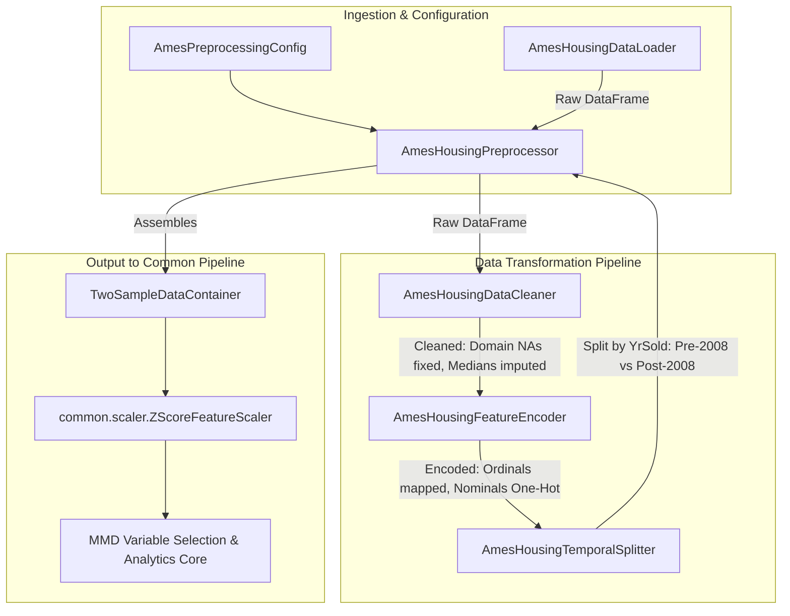
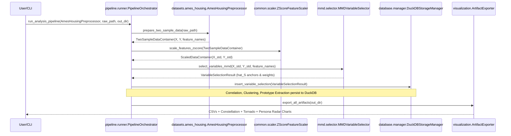

# Ames Housing Dataset: Module & Processing Architecture Plan

## 1. Overview & Analytical Objective

The **Ames Housing Dataset** (compiled by Dean De Cock) provides an empirical real estate testbed containing 2,930 property sales across 80+ structural, architectural, and geographic variables.

### Analytical Objective
Instead of predicting house prices, this project applies **MMD-based two-sample variable selection** to investigate:
> *"What intrinsic structural and neighborhood attributes distinguished the properties that transacted during the housing bubble (Pre-Crash: 2006–2007) from those that transacted during the recession (Post-Crash: 2009–2010)?"*

To interface with the common analytical pipeline defined in [plans/package-module.md](file:///root/project-data-analysis-variable-selection/plans/package-module.md), the Ames Housing adapter must handle complex domain-specific preprocessing (the "Domain NA" trap, ordinal scale mapping, neighborhood-grouped imputation, one-hot encoding, and temporal splitting) and output a standardized `TwoSampleDataContainer`.

---

## 2. Dataset Specifications & Domain Nuances

### 2.1. Basic Attributes
- **Total Observations:** 2,930 property sales.
- **Raw Features:** ~80 columns (excluding unique identifier `PID`/`Id`).
- **Feature Types:** Continuous (area/dimensions), Ordinal (ratings/quality), Nominal (neighborhood, zoning, building style).
- **Target Partitioning ($X$ vs. $Y$):**
  - **Distribution $X$ (Pre-Crash Market):** Properties sold in **2006 and 2007** ($N_X \approx 1,200\text{–}1,300$).
  - **Distribution $Y$ (Post-Crash Market):** Properties sold in **2009 and 2010** ($N_Y \approx 1,100\text{–}1,200$).
  - **Transition Epoch (2008):** Sales from 2008 are excluded by default to maintain sharp contrast between pre-crisis peak and post-crisis contraction.
- **Leakage Columns Dropped:** `YrSold`, `MoSold`, `SalePrice`, `SaleType`, `SaleCondition` (unless explicitly studied), `Order`, `PID`.

### 2.2. Domain Gotchas & Treatment Rules
1. **The "Domain NA" Trap:**
   - In Ames, `NA` in categorical facility columns represents the **absence of a physical feature**, not missing data.
   - *Categorical Treatment:* Replace `NA` with `"None"` in `PoolQC`, `MiscFeature`, `Alley`, `Fence`, `FireplaceQu`, `GarageType`, `GarageFinish`, `GarageQual`, `GarageCond`, `BsmtQual`, `BsmtCond`, `BsmtExposure`, `BsmtFinType1`, `BsmtFinType2`.
   - *Continuous Treatment:* Replace `NA` with `0` in `GarageArea`, `GarageCars`, `TotalBsmtSF`, `BsmtFinSF1`, `BsmtFinSF2`, `BsmtUnfSF`, `BsmtFullBath`, `BsmtHalfBath`, `MasVnrArea`.
2. **Neighborhood-Grouped Imputation:**
   - `LotFrontage` (linear feet of street connected to property) has true missing values. Imputation must use the **median `LotFrontage` of properties in the same `Neighborhood`** (falling back to global median if a neighborhood is missing entirely).
3. **Ordinal Feature Integer Mapping:**
   - Quality/condition metrics must be mapped monotonically to integers ($1\text{–}5$) to preserve geometry for $L_2$ distance in MMD kernel calculations:
     - Rating Scale: `{"Ex": 5, "Gd": 4, "TA": 3, "Fa": 2, "Po": 1, "None": 0}`.
     - Applied to: `ExterQual`, `ExterCond`, `BsmtQual`, `BsmtCond`, `HeatingQC`, `KitchenQual`, `FireplaceQu`, `GarageQual`, `GarageCond`, `PoolQC`.
     - Exposure Scale: `{"Gd": 4, "Av": 3, "Mn": 2, "No": 1, "None": 0}` for `BsmtExposure`.
     - Basement Finish: `{"GLQ": 6, "ALQ": 5, "BLQ": 4, "Rec": 3, "LwQ": 2, "Unf": 1, "None": 0}` for `BsmtFinType1`, `BsmtFinType2`.
4. **Nominal One-Hot Encoding:**
   - Categorical features with no natural order (e.g., `Neighborhood`, `HouseStyle`, `BldgType`, `Foundation`, `RoofStyle`, `Exterior1st`, `Exterior2nd`) are One-Hot Encoded.
   - Expands the total feature dimension to **$\approx 150\text{–}200$ features**, creating an ideal high-dimensional scenario for MMD variable selection.

---

## 3. Module Architecture & Directory Structure

The Ames Housing adapter will reside in `data_analysis_variable_selection/datasets/ames_housing/`:

```
data_analysis_variable_selection/datasets/ames_housing/
├── __init__.py
├── config.py             # AmesPreprocessingConfig, column categorizations, ordinal maps
├── loader.py             # AmesHousingDataLoader (local CSV / OpenML fetcher)
├── cleaner.py            # AmesHousingDataCleaner (Domain NA handler & neighborhood imputer)
├── encoder.py            # AmesHousingFeatureEncoder (Ordinal mapper & One-Hot encoder)
├── splitter.py           # AmesHousingTemporalSplitter (Filters 2006-2007 vs 2009-2010)
└── preprocessor.py       # AmesHousingPreprocessor (Implements BaseDatasetPreprocessor)
```

---

## 4. Component Relations & Data Flow



---

## 5. Detailed Component Specifications

In compliance with project coding standards:
- **Latin function/method naming:** `verb_noun_adjectives` (e.g., `clean_domain_nas`, `impute_missing_values_neighborhood`, `encode_features_ordinal`).
- **German class naming:** `Adjective/Noun Noun` with `-er/-or` suffixes (e.g., `AmesHousingDataCleaner`, `AmesHousingFeatureEncoder`, `AmesHousingPreprocessor`).
- **Pydantic models:** Used for structured configurations and multi-value returns.
- **Type hints:** Exhaustive type annotations with `import typing as ty`.
- **Block comments:** `# end <block name>` for all control blocks.

### 5.1. `config.py`
Defines mappings, column groupings, and Pydantic configuration schemas:
- **`AmesPreprocessingConfig(BaseModel)`**:
  - `path_data_file: ty.Optional[str]`
  - `years_pre_crash: ty.List[int] = [2006, 2007]`
  - `years_post_crash: ty.List[int] = [2009, 2010]`
  - `drop_transition_year_2008: bool = True`
  - `columns_to_drop: ty.List[str] = ["YrSold", "MoSold", "SalePrice", "Order", "PID", "SaleType", "SaleCondition"]`
  - `categorical_na_to_none_cols: ty.List[str]`
  - `continuous_na_to_zero_cols: ty.List[str]`
  - `ordinal_mapping_dicts: ty.Dict[str, ty.Dict[str, int]]`
  - `nominal_columns_to_onehot: ty.List[str]`

### 5.2. `loader.py` (`AmesHousingDataLoader`)
- **Responsibility:** Loads raw data from a local CSV file, downloadable URL, or OpenML (`data_id=42165`).
- **Key Methods:**
  - `load_data_raw(path_source: ty.Optional[str] = None) -> pd.DataFrame`
  - `_fetch_data_from_openml() -> pd.DataFrame`

### 5.3. `cleaner.py` (`AmesHousingDataCleaner`)
- **Responsibility:** Executes domain NA corrections and neighborhood-stratified imputation.
- **Key Methods:**
  - `clean_dataset_domain_nas(df_raw: pd.DataFrame, config: AmesPreprocessingConfig) -> pd.DataFrame`
  - `impute_missing_values_neighborhood(df_clean: pd.DataFrame, column_target: str = "LotFrontage", column_group: str = "Neighborhood") -> pd.DataFrame`
  - `impute_remaining_features_generic(df_imputed: pd.DataFrame) -> pd.DataFrame`

### 5.4. `encoder.py` (`AmesHousingFeatureEncoder`)
- **Responsibility:** Transforms text/categorical fields into numerical representations suitable for $L_2$ metric space.
- **Key Methods:**
  - `encode_features_ordinal(df_data: pd.DataFrame, mapping_configs: ty.Dict[str, ty.Dict[str, int]]) -> pd.DataFrame`
  - `encode_features_nominal_onehot(df_data: pd.DataFrame, columns_nominal: ty.List[str]) -> pd.DataFrame`
  - `extract_feature_metadata(df_encoded: pd.DataFrame) -> ty.Dict[str, ty.Any]`

### 5.5. `splitter.py` (`AmesHousingTemporalSplitter`)
- **Responsibility:** Partitions the encoded dataset into the two distributions based on sale date and strips temporal target leakage.
- **Key Methods:**
  - `split_samples_temporal(df_encoded: pd.DataFrame, config: AmesPreprocessingConfig) -> ty.Tuple[pd.DataFrame, pd.DataFrame]`
  - `drop_leakage_columns(df_data: pd.DataFrame, columns_to_drop: ty.List[str]) -> pd.DataFrame`

### 5.6. `preprocessor.py` (`AmesHousingPreprocessor`)
- **Responsibility:** Coordinates the end-to-end data transformation pipeline and implements `BaseDatasetPreprocessor`.
- **Key Methods:**
  - `prepare_two_sample_data(path_data: ty.Optional[str] = None) -> TwoSampleDataContainer`
  - Implements the contract:
    1. Loads raw DataFrame via `AmesHousingDataLoader`.
    2. Cleans domain NAs and imputes missing fields via `AmesHousingDataCleaner`.
    3. Maps ordinals and one-hot encodes nominals via `AmesHousingFeatureEncoder`.
    4. Splits into Pre-Crash ($X$) and Post-Crash ($Y$) matrices via `AmesHousingTemporalSplitter`.
    5. Returns `TwoSampleDataContainer(sample_matrix_x=X_arr, sample_matrix_y=Y_arr, name_features=col_names, metadata_dataset=...)`.

---

## 6. Integration with Common Pipeline

Once `AmesHousingPreprocessor` returns `TwoSampleDataContainer`:



---

## 7. Verification & Testing Plan

### 7.1. Unit Tests (`tests/datasets/ames_housing/`)
1. **`test_cleaner.py`**:
   - Verify `PoolQC` `NA` is transformed to `"None"` without data loss.
   - Verify `GarageArea` `NA` is transformed to `0`.
   - Verify `LotFrontage` is correctly imputed using neighborhood medians with no remaining `NaN`s.
2. **`test_encoder.py`**:
   - Verify ordinal columns (`ExterQual`, `KitchenQual`) map strictly to integers $1\text{–}5$.
   - Verify nominal columns are converted to one-hot binary columns with dummy prefixes.
3. **`test_splitter.py`**:
   - Verify records from 2008 are excluded.
   - Verify $X$ contains only 2006–2007 rows and $Y$ contains only 2009–2010 rows.
   - Verify leakage columns (`SalePrice`, `YrSold`, `MoSold`) are stripped from feature matrices.
4. **`test_preprocessor.py`**:
   - Verify end-to-end execution returning a valid `TwoSampleDataContainer` where `X.shape[1] == Y.shape[1] == len(name_features)`.

### 7.2. Integration Verification
- Run with synthetic Ames subset and run through `ZScoreFeatureScaler` to assert no infinite or `NaN` values in scaled matrices.
- Run a smoke test against `MMDVariableSelector` to ensure the anchor variable indices $\hat{S}$ map cleanly to the engineered housing feature names.
