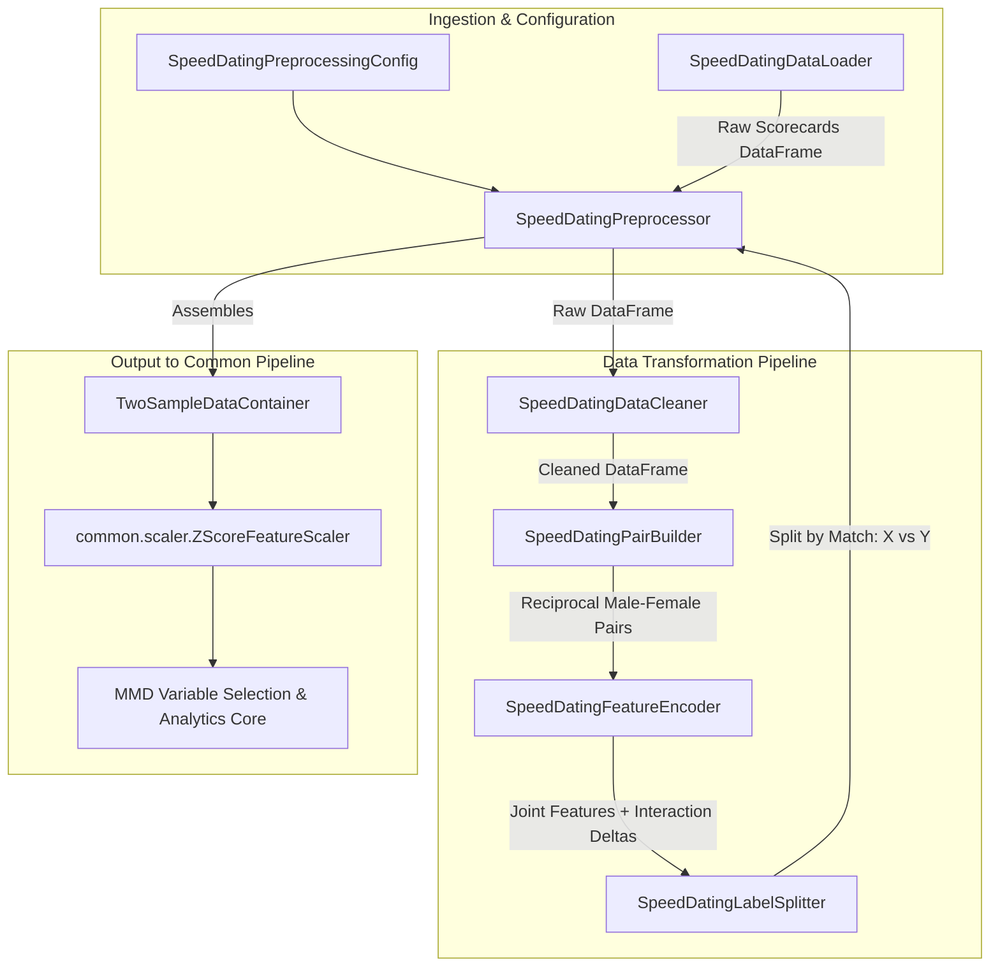
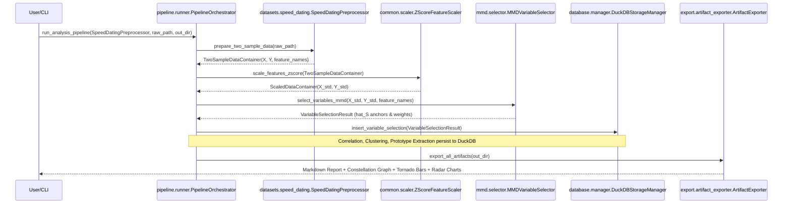

# Speed Dating Dataset: Module & Processing Architecture Plan

## 1. Overview & Analytical Objective

The **Columbia Business School Speed Dating Experiment** (conducted by Ray Fisman and Sheena Iyengar) provides a landmark empirical dataset capturing 8,378 individual date scorecards from speed dating events across 21 waves.

### Analytical Objective
In standard machine learning, this dataset is often used to predict whether an individual will say "yes" (`dec = 1`) or if a mutual match occurs (`match = 1`). In this project, we reframe the problem under **MMD-based two-sample variable selection**:
> *"What intrinsic profile traits, personal values, self-evaluations, and partner compatibilities distinguish a mutually successful date (Match: $X$) from an unsuccessful one (No Match: $Y$)?"*

Unlike predictive black-box models, MMD two-sample variable selection identifies the sparse, intrinsic subspace of variables ($\hat{S}$) that drive the maximum distributional divergence between matched and unmatched pairs.

To integrate seamlessly with the common analytical pipeline defined in [plans/package-module.md](file:///root/data_analysis_variable_selection/plans/package-module.md), the Speed Dating adapter transforms individual participant scorecards into a **Joint Date-Interaction Space** and outputs a standardized `TwoSampleDataContainer`.

---

## 2. Dataset Specifications & Domain Nuances

### 2.1. Basic Attributes
- **Raw Observations:** 8,378 individual subjective survey records (rows).
- **Date Pair Potential:** Since each speed date involves two individuals, the raw dataset represents up to 4,189 unique date encounters.
- **Intact Reciprocal Pairs:** Approximately **~4,000 to 4,100 intact pairs** where both participants completed evaluations.
- **Raw Feature Count:** 195 columns in the original CSV (spanning participant demographics, pre-date preferences, post-date partner ratings, and follow-up surveys).
- **Target Partitioning ($X$ vs. $Y$):**
  - **Distribution $X$ (Mutual Match, `Match = 1`):** Both participants agreed to see each other again ($N_X \approx 650\text{–}800$ pairs, ~16–20% mutual match rate).
  - **Distribution $Y$ (No Mutual Match, `Match = 0`):** At least one participant declined to see the other again ($N_Y \approx 3,300\text{–}3,450$ pairs).

### 2.2. Domain Gotchas & Methodological Nuances
1. **The Individual-to-Date Entity Shift (Reciprocal Pairing):**
   - The raw data is row-per-person-per-date. Two rows represent the same physical date encounter:
     - Person A (`iid = A`, `pid = B`) evaluating Person B.
     - Person B (`iid = B`, `pid = A`) evaluating Person A.
   - An inner join on `(wave, iid, pid)` and `(wave, pid, iid)` reconstructs the unified date interaction.
2. **Gender Separation & Homosexuality Consideration:**
   - In the Columbia experimental protocol, all 21 waves strictly paired male and female subjects (`gender = 1` for Male, `gender = 0` for Female).
   - To maintain generalizability and support non-heterosexual or gender-neutral pairings in other social datasets, internal schemas designate roles as `Person A` and `Person B` (canonically mapped to `Male` and `Female` for this experiment).
3. **Incomplete Reciprocal Scorecards:**
   - In ~2% of dates, one participant failed to hand in their scorecard or skipped partner IDs. These broken pairs must be filtered out so that every sample in $X$ and $Y$ represents a reciprocal mutual observation.
4. **Scale Heterogeneity & Z-Score Standardization:**
   - Features span disparate scales: continuous age (18–55), 1–10 Likert ratings (interests, self-perception), 1–7 frequency scales (`date`, `go_out`), percentage point allocations (summing to 100), and binary compatibility flags ($0/1$).
   - Standardizing the pooled feature space ($Z = X \cup Y$) with Z-score normalization ($\mu = 0, \sigma = 1$) is mandatory to prevent high-scale variables from dominating kernel $L_2$ norm distances.

---

## 3. Feature Selection & Discarding Criteria

To ensure rigorous statistical inference and avoid trivial/tautological findings, we establish strict, principled criteria for feature inclusion and exclusion.

### 3.1. Discard / Exclusion Criteria

| Category | Columns Dropped | Methodological Rationale |
| :--- | :--- | :--- |
| **Target Leakage & Direct Outcomes** | `match`, `dec`, `dec_o` | Directly encode the two-sample assignment or individual decisions. |
| **Administrative & Experimental Artifacts** | `iid`, `pid`, `id`, `idg`, `condtn`, `wave`, `round`, `position`, `positin1`, `order`, `partner` | Station numbers, date sequence, wave IDs, and seat positions reflect experimental mechanics rather than intrinsic human compatibility traits. |
| **Severe Missingness (>30%)** | Follow-up surveys: `*_2`, `*_3` (e.g., `attr1_2`, `satsin`, `date_3`, `numdat_3`), `income` (>40% missing), `tuition` | Time 2 (next-day) and Time 3 (3-week) surveys were returned by less than 30% of participants, creating massive sample attrition. |
| **High-Cardinality Unstructured Text** | `field`, `undergra`, `career`, `from`, `zipcode` | Free-text strings with hundreds of sparse categories. (Captured numerically via standardized code mappings `field_cd` and `career_c`). |
| **Wave-Inconsistent Scales** | `attr5_1`, `sinc5_1`, `intel5_1`, `fun5_1`, `amb5_1` | Questions on how participants think others perceive them were only administered in waves 6–21, resulting in systematic structural missingness for waves 1–5. |
| **Post-Date Evaluative Scores (Primary Model)** | `attr`, `sinc`, `intel`, `fun`, `amb`, `shar`, `like`, `prob`, `met` | **The Evaluative Tautology Trap:** Ratings given *after* the date (e.g., `like = 10`) are post-hoc perceptual outcomes, not intrinsic profile traits. To discover what *causes* attraction before interaction, the primary model excludes post-date ratings. *(Configurable toggle provided for secondary perceptual analysis).* |


TODO: Regarding "High-Cardinality Unstructured Text", `career`, `from`, `zipcode` do not exist. Race fields exist. Can we represents the closeness of the races somehow?


### 3.2. Inclusion Criteria & Selected Core Variables

A variable is selected if:
1. **Pre-Date Observability:** It was measured prior to the date interaction (Survey 1).
2. **Cross-Wave Completeness:** Measured consistently across all 21 waves with missingness $< 5\%$.
3. **Semantic Relevance:** Captures personal identity, lifestyle habits, leisure activities, self-concept, or stated partner preferences.

#### Core Feature Inventory (~34 Variables per Participant):
1. **Demographics & Social Habits (6 features):**
   - `age`: Age in years.
   - `imprace`: Importance of partner being of the same race (1–10).
   - `imprelig`: Importance of partner having the same religion (1–10).
   - `date`: Dating frequency ($1 = \text{several times a week} \dots 7 = \text{almost never}$).
   - `go_out`: Social frequency ($1 = \text{several times a week} \dots 7 = \text{almost never}$).
   - `goal`: Primary motivation ($1 = \text{fun night out}, 2 = \text{meet people}, 3 = \text{get a date}, 4 = \text{serious relationship}, \dots$).
2. **Leisure & Activity Interests (17 features, 1–10 scale):**
   - `sports`, `tvsports`, `exercise`, `dining`, `museums`, `art`, `hiking`, `gaming`, `clubbing`, `reading`, `tv`, `theater`, `movies`, `concerts`, `music`, `shopping`, `yoga`.
3. **Self-Perception / Self-Esteem Ratings (5 features, 1–10 scale):**
   - `attr3_1`: Self-rated physical attractiveness.
   - `sinc3_1`: Self-rated sincerity.
   - `intel3_1`: Self-rated intelligence.
   - `fun3_1`: Self-rated humor/fun.
   - `amb3_1`: Self-rated ambition.
4. **Stated Mate Preferences (6 features, normalized to % share):**
   - `attr1_1`, `sinc1_1`, `intel1_1`, `fun1_1`, `amb1_1`, `shar1_1`: Weight assigned to attractiveness, sincerity, intelligence, fun, ambition, and shared interests in prospective partners.

### 3.3. Joint Feature Space & Homophily Interaction Deltas

Rather than treating dates as isolated individual profiles, we construct a **Joint Date-Interaction Space** ($d \approx 95$ features):
1. **Direct Concatenation ($34 \times 2 = 68$ features):**
   - `Male_Age`, `Male_Go_Out`, `Male_Sports`, $\dots$
   - `Female_Age`, `Female_Go_Out`, `Female_Sports`, $\dots$
2. **Homophily & Similarity Deltas (~25 features):**
   - **Demographic Differences:**
     - $\text{Age\_Gap} = |\text{Male\_Age} - \text{Female\_Age}|$
     - $\text{Same\_Race} = \mathbb{I}(\text{Male\_Race} == \text{Female\_Race})$
     - $\text{Same\_Field} = \mathbb{I}(\text{Male\_Field\_Cd} == \text{Female\_Field\_Cd})$
     - $\text{Same\_Goal} = \mathbb{I}(\text{Male\_Goal} == \text{Female\_Goal})$
   - **Interest Deltas (17 features):**
     - Absolute differences across all 17 activities: $|\text{Male\_Interest}_k - \text{Female\_Interest}_k|$.
   - **Holistic Interest Vector Cosine Similarity (1 feature):**
     - $\text{Interest\_Cosine\_Sim} = \frac{\mathbf{v}_{\text{Male}} \cdot \mathbf{v}_{\text{Female}}}{\|\mathbf{v}_{\text{Male}}\| \|\mathbf{v}_{\text{Female}}\|}$
   - **Preference-Trait Alignment Deltas (4 features):**
     - Does Male self-rated attractiveness satisfy Female stated attractiveness preference?
       - $\Delta_{\text{Attr\_Align}} = |\text{Male\_attr3\_1} - \text{Female\_attr1\_1}_{\text{rescaled}}|$
     - Reciprocal alignment for intelligence, fun, and ambition.

---

## 4. Preprocessing Pipeline Architecture

The end-to-end dataset transformation follows an 8-stage contract:

```
[1. Ingestion / Download]
        │
[2. Participant ID Verification]
        │
[3. Reciprocal Pair Formation (Inner Join on Male & Female)]
        │
[4. Joint Feature Construction & Unique Pair Hash ID]
   unique_id_feature = hash(iid_person_a, iid_person_b)
        │
[5. Feature Persistence into DuckDB Warehouse]
        │
[6. Raw Data Ingestion into DuckDB Warehouse]
        │
[7. Z-Score Standardization (Pooled Z = X ∪ Y)]
        │
[8. Export TwoSampleDataContainer & NumPy Structured Array]
```

---

## 5. Module Architecture & Directory Structure

The Speed Dating adapter resides in `data_analysis_variable_selection/datasets/speed_dating/`:

```
data_analysis_variable_selection/datasets/speed_dating/
├── __init__.py
├── config.py             # SpeedDatingPreprocessingConfig, column selections, interest lists
├── loader.py             # SpeedDatingDataLoader (local CSV / URL / OpenML / synthetic fallback)
├── cleaner.py            # SpeedDatingDataCleaner (imputation of missing survey ratings, type coercion)
├── pair_builder.py       # SpeedDatingPairBuilder (reciprocal inner join, pair ID hash generation)
├── encoder.py            # SpeedDatingFeatureEncoder (homophily deltas, cosine similarity, joint vector)
├── splitter.py           # SpeedDatingLabelSplitter (partitions into X [match] and Y [no match])
├── preprocessor.py       # SpeedDatingPreprocessor (implements BaseDatasetPreprocessor)
└── report_generator.py   # SpeedDatingReportGenerator (implements BaseDatasetReportGenerator)
```

---

## 6. Component Relations & Data Flow

### 6.1. Preprocessing Data Flow



---

## 7. Detailed Component Specifications

In compliance with project coding standards:
- **Latin method/function naming:** `verb_noun_adjectives` (e.g., `build_pairs_reciprocal`, `compute_features_interaction`, `split_samples_label`).
- **German class naming:** `Adjective/Noun Noun` with `-er/-or` suffixes (e.g., `SpeedDatingDataLoader`, `SpeedDatingPairBuilder`, `SpeedDatingFeatureEncoder`, `SpeedDatingPreprocessor`).
- **Pydantic models:** Used for structured configurations and multi-value returns.
- **Type hints:** Exhaustive type annotations with `import typing as ty`.
- **Block comments:** `# end <block name>` for all control blocks.

### 7.1. `config.py`
Defines mappings, column groupings, and Pydantic configuration schemas:
- **`SpeedDatingPreprocessingConfig(BaseModel)`**:
  - `path_data_file: ty.Optional[str] = None`
  - `max_records_per_distribution: ty.Optional[int] = 500`
  - `random_seed_sampling: int = 42`
  - `include_interaction_deltas: bool = True`
  - `include_post_date_evaluations: bool = False`
  - `columns_demographics: ty.List[str] = ["age", "imprace", "imprelig", "date", "go_out", "goal"]`
  - `columns_interests: ty.List[str] = ["sports", "tvsports", "exercise", "dining", "museums", "art", "hiking", "gaming", "clubbing", "reading", "tv", "theater", "movies", "concerts", "music", "shopping", "yoga"]`
  - `columns_self_ratings: ty.List[str] = ["attr3_1", "sinc3_1", "intel3_1", "fun3_1", "amb3_1"]`
  - `columns_stated_preferences: ty.List[str] = ["attr1_1", "sinc1_1", "intel1_1", "fun1_1", "amb1_1", "shar1_1"]`
  - `columns_administrative_to_drop: ty.List[str] = ["id", "idg", "condtn", "wave", "round", "position", "positin1", "order", "partner"]`

### 7.2. `loader.py` (`SpeedDatingDataLoader`)
- **Responsibility:** Loads raw data from a local CSV file, remote URL, OpenML (`data_id=40536`), or generates a representative synthetic dataset for offline unit tests.
- **Key Methods:**
  - `load_data_raw(path_source: ty.Optional[str] = None) -> pd.DataFrame`
  - `_generate_synthetic_speed_dating_data(n_participants: int = 40, n_dates_per_person: int = 10) -> pd.DataFrame`

### 7.3. `cleaner.py` (`SpeedDatingDataCleaner`)
- **Responsibility:** Handles imputation of missing Likert scores and median-fills missing demographic values.
- **Key Methods:**
  - `clean_dataset_survey_fields(df_raw: pd.DataFrame, config: SpeedDatingPreprocessingConfig) -> pd.DataFrame`
  - `impute_missing_ratings_median(df_data: pd.DataFrame, columns_to_impute: ty.List[str]) -> pd.DataFrame`

### 7.4. `pair_builder.py` (`SpeedDatingPairBuilder`)
- **Responsibility:** Partitions by gender, merges reciprocal encounters, and generates deterministic pair hash IDs.
- **Key Methods:**
  - `build_pairs_reciprocal(df_clean: pd.DataFrame) -> pd.DataFrame`
  - `generate_id_pair_hash(id_person_a: int, id_person_b: int) -> str`
    - Implemented as `hashlib.sha256(f"{min(id_a, id_b)}_{max(id_a, id_b)}".encode()).hexdigest()[:16]` for symmetry.

### 7.5. `encoder.py` (`SpeedDatingFeatureEncoder`)
- **Responsibility:** Constructs joint features and computes homophily deltas and cosine similarity.
- **Key Methods:**
  - `encode_features_joint(df_pairs: pd.DataFrame, config: SpeedDatingPreprocessingConfig) -> pd.DataFrame`
  - `compute_deltas_homophily(df_pairs: pd.DataFrame, columns_interests: ty.List[str]) -> pd.DataFrame`
  - `compute_similarity_interest_cosine(vector_a: np.ndarray, vector_b: np.ndarray) -> float`

### 7.6. `splitter.py` (`SpeedDatingLabelSplitter`)
- **Responsibility:** Partitions into Distribution $X$ (`match = 1`) and Distribution $Y$ (`match = 0`), stripping leakage columns.
- **Key Methods:**
  - `split_samples_by_match(df_joint: pd.DataFrame) -> ty.Tuple[pd.DataFrame, pd.DataFrame]`
  - `drop_leakage_columns(df_data: pd.DataFrame) -> pd.DataFrame`

### 7.7. `preprocessor.py` (`SpeedDatingPreprocessor`)
- **Responsibility:** Implements `BaseDatasetPreprocessor` to coordinate ingestion, cleaning, pairing, encoding, and splitting into `TwoSampleDataContainer`.
- **Key Methods:**
  - `prepare_two_sample_data(path_data: ty.Optional[str] = None, max_records_per_distribution: ty.Optional[int] = None, apply_subsampling: bool = True, **kwargs: ty.Any) -> TwoSampleDataContainer`

### 7.8. `report_generator.py` (`SpeedDatingReportGenerator`)
- **Responsibility:** Implements `BaseDatasetReportGenerator` to produce an exploratory domain report comparing matched vs. unmatched pairs across demographic, interest, and preference dimensions.
- **Key Methods:**
  - `generate_dataset_report(container: TwoSampleDataContainer, path_output_dir: str) -> DatasetReportArtifacts`
  - `compute_statistics_dating_habits(df_x: pd.DataFrame, df_y: pd.DataFrame) -> ty.List[NumericMetricSummary]`

---

## 8. Integration with Common Pipeline



---

## 9. Verification & Testing Plan

### 9.1. Unit Tests (`tests/datasets/speed_dating/`)
1. **`test_loader.py`**:
   - Verify loading from local CSV file.
   - Verify synthetic fallback data generation produces consistent columns when offline.
2. **`test_cleaner.py`**:
   - Verify missing ratings in 1–10 interest scales are imputed with valid integer/float medians.
   - Verify non-numeric values are safely coerced.
3. **`test_pair_builder.py`**:
   - Verify unreciprocated dates (only one scorecard available) are safely dropped.
   - Verify paired row count matches expectation.
   - Verify unique pair hash ID generation is symmetric: `hash(A, B) == hash(B, A)`.
4. **`test_encoder.py`**:
   - Verify homophily interaction deltas (`Age_Gap`, `Same_Race`, `Art_Diff`) are correctly calculated.
   - Verify cosine similarity produces bounded values $[-1.0, 1.0]$.
5. **`test_splitter.py`**:
   - Verify $X$ contains only mutual matches (`match = 1`) and $Y$ contains only non-matches (`match = 0`).
   - Verify outcome and leakage columns (`match`, `dec`, `dec_o`, `iid`, `pid`) are completely purged from feature matrices.
6. **`test_preprocessor.py`**:
   - End-to-end execution returning a valid `TwoSampleDataContainer` satisfying $X.\text{shape}[1] == Y.\text{shape}[1] == \text{len}(\text{name\_features})$.
   - Verify deterministic subsampling when `max_records_per_distribution` is specified.

### 9.2. Integration Verification
- **Z-Score Scaler Compatibility:** Pass output `TwoSampleDataContainer` through `ZScoreFeatureScaler` to confirm no infinite or NaN values in standardized matrices.
- **MMD Algorithm Execution:** Run a smoke test with `MMDVariableSelector` on CPU with small sample size to ensure anchor indices $\hat{S}$ map cleanly to joint speed dating feature names.
- **DuckDB Persistence:** Verify all features and selection records insert cleanly into DuckDB warehouse tables.
